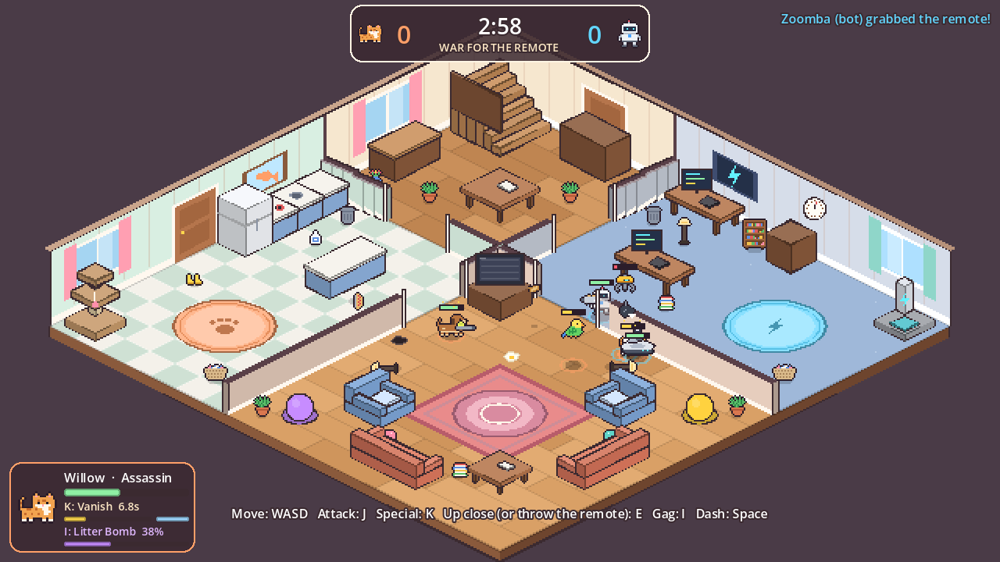

# Willow VS The World

A cozy, chaotic, isometric pixel-art multiplayer brawler. The parents just left
for the day. The **pets** and the **robots** immediately go to war over the TV
remote... and then have to put the whole house back together before the car
pulls back into the driveway.


**Phase 1: War for the remote.** Team capture-the-flag with over-the-top weapons.
Grab the remote, carry it to your team's rug, and hold it there for three seconds to
change the channel. Blast anyone who tries, and the furniture too. KOs are just naps.

**Phase 2: Cover it up.** *CAR IN THE DRIVEWAY!* Truce. Everyone, both teams,
cleans up, and everyone does it differently: Zoomba vacuums, Willow bats books and
toys under the couch, Bass thumps the stains away, Pepper fetches whatever got
knocked over, Biscuit kneads the cushions, Unit-7 fixes, the Claw lifts and Kiwi
puts things back up high. Anyone can help with anything, but at a fifth of the
speed, so after a big war the house only gets spotless if everyone plays to their
strengths. The war's winners only get to watch their show if the house passes
inspection. Otherwise everybody is grounded.

Things pop up on the floor all the while: in the war, power-ups (the zoomies,
bubble wrap, snacks, treats that charge your gag) and other characters' weapons;
in the cleanup, turbo tools that only the chore's owner can pick up, and roller
skates.

| Pick a side | Clean up together |
|---|---|
|  |  |

### The homes

Pick where the fight happens in the lobby. Each home plays differently.

| The Family Home | Suburban House | The Farmhouse |
|---|---|---|
|  |  |  |
| Kitchen, dining room, den and living room in a ring. The default. 4-8 players. | A long ranch house: kitchen, dining room, living room, garage and den. 6-8 players. | Four rooms round an old stone chimney, with a porch all the way round. 4-6 players. |

...plus the **Studio Apartment** (one tiny room, constant brawling, 2-4 players) and
**The Living Room (classic)**, the original open room, a good place to learn.

**Inside walls** are drawn like a dollhouse with the top cut off, so you can see
over them, and they turn see-through when someone's behind them. Shots, blasts,
swings and a thrown remote all stop at them (except Bass's bass waves, which go
right through). Only the **big hitters** can knock through a plain painted wall:
Biscuit's bazooka and belly flop, the Claw's wrecking ball and claw drop, Unit-7's
rocket fist and satellite laser, and Pepper while he holds the Big Bone. Everything
else just goes *tink*. Stone and outside walls never break. A hole is a new way
through for everyone, and one more thing to fix before the parents get home.
Birds and the Claw fly over the walls, but not while carrying the remote: it
weighs them down, so they have to use the doors.

The design doc has a list of homes to build next and a step-by-step guide to
making your own.

The full design (rules, roster, homes, art direction, networking, roadmap) is in
**[docs/GAME_DESIGN.md](docs/GAME_DESIGN.md)**.

## The characters

Everyone gets a ridiculous weapon, one big strength and one real weakness. The
pets are sneaky and chaotic, the robots have sensors and are great at repairs.

| Team Pets | Weapon | Up close | + Strength | - Weakness |
|---|---|---|---|---|
| **Willow**, tabby cat | Laser Pointer Blaster | **Pounce**: hop forward and swipe | Invisible when still; *Vanish*; double-damage ambushes | Fragile |
| **Biscuit**, chonky cat | Catnip Bazooka | **Making Biscuits**: kneads you, heals herself | Heavy (half knockback), sneaky | Slow |
| **Pepper**, pup | Tennis Ball Gatling | **Gimme!**: a bite that steals the remote | Nose sniffs out hidden enemies | Butterfingers: drops the remote when hit |
| **Kiwi**, budgie | Egg Bombs | **Peck Peck Peck**: mash it; topples even shelves | Flies over furniture | Featherweight |

| Team Robots | Weapon | Up close | + Strength | - Weakness |
|---|---|---|---|---|
| **Zoomba**, robot vacuum | Dust Cannon | **Spot Clean**: spins, flinging everyone around it | Hides under furniture for ambushes | Flips over when hit hard |
| **Unit-7**, helper bot | Toaster Cannon | **Spatula Flip**: flips you into the air, stunned | X-ray vision; rebuilds twice as fast | Clunky |
| **The Claw**, ceiling gantry | Wrecking Ball | **Yoink!**: reels you in under the claw | Rides the ceiling; lifts heavy things alone | Long reboot after a KO |
| **Bass**, smart speaker | Subwoofer Cannon | **Feedback**: a squeal that blasts you away | Cleaning playlist speeds up everyone's cleaning | No legs: tiny dash |

Everyone also has a **gag**: a big, silly, charge-up move themed on what they are,
which also plays to their strengths:

| Gag | Who | What happens |
|---|---|---|
| **Litter Bomb** | the cats | A litter box bursts into a dust cloud; cats stay invisible inside it, everyone else is bogged down |
| **Big Bone** | Pepper | Every whack is a home run, and a dog never drops the remote while holding a bone |
| **Flock Call** | Kiwi | A stampede of budgies bowls over a whole lane; Kiwi rides along at top speed |
| **Mega Suck** | Zoomba | Drags enemies in and swallows them (and the remote), then spits them out |
| **Satellite Laser** | Unit-7 | Orbital strike from space, plus a scan that reveals every hidden pet |
| **Claw Machine** | The Claw | Grabs whoever's underneath and carries them off, remote and all |
| **Dance Party** | Bass | Every enemy nearby has to dance; allies heal |

Furniture has health: the wrecking ball, bazooka and friends reduce couches, tables
and walls to rubble, which has to be rebuilt before the parents get home.

Everything makes a noise: every weapon, gag and KO (each character has their own
voice), the parents' car pulling away and honking back into the driveway, a ticking
clock in the last ten seconds, and a chiptune soundtrack for the menus, the war and
the cleanup. Volume controls are under **Sound** on the title screen and in the
Esc menu.


## Play it

1. Download **[Godot 4.7](https://godotengine.org/download)** (free, the standard
   version, not .NET). It's a single ~150 MB program; nothing to install.
2. Open Godot, click **Import**, and select `game/project.godot` from this repo.
3. Press **F5** (or the ▶ button in the top right).

Choose **Practice vs bots** to play alone. Bots fill any empty spots, and you can
add or remove them in the lobby.

### Controls

| | Keyboard | Joy-Con, held sideways | Other controllers |
|---|---|---|---|
| Move | WASD / arrows | stick | left stick or D-pad |
| Attack (hold for automatic weapons) | J | left button | left face button (Xbox X, Switch Y) |
| Special | K | top button | top face button (Xbox Y, Switch X) |
| Dash | Space | bottom button | bottom face button (Xbox A, Switch B) |
| Up close move / throw the remote / hold to tidy | E | right button | right face button (Xbox B, Switch A) |
| Gag (when the meter is full) | I or Q | SL or SR | a shoulder button or trigger |
| Menu (pauses in Practice) | Esc | + or - | Start or Back |
| Fullscreen on/off | F11 or Alt+Enter | | |

Buttons go by position, not by the letter printed on them, so a Joy-Con works the
same whichever way round it is.

### Everyone on one screen (Joy-Cons and a TV)

Up to 8 people can play on one computer, each with their own controller, all on
one screen (cast or plug the laptop into the TV).

1. **Pair each Joy-Con with the computer.** Windows: *Settings > Bluetooth & devices >
   Add device > Bluetooth*. Mac: *System Settings > Bluetooth*. Hold the small round sync
   button on the Joy-Con's inner edge (between SL and SR) until its lights run, then pick
   "Joy-Con (L)" or "Joy-Con (R)" from the list. Other controllers pair the same way or
   just plug in.
2. **Start the game** and choose **Practice vs bots** (or **Host a game** if friends
   elsewhere are joining too).
3. **In the lobby, everyone joins:** hold your Joy-Con sideways and press **SL + SR**
   together (the two small buttons on its inner edge), just like on a Switch. Two
   Joy-Cons held together as one controller, or a Pro/Xbox controller: press **L + R**
   (other controllers also join with any button). On the keyboard: **J**. The first
   person becomes P1, the next P2, and so on. Each person's number and colour (P1 red,
   P2 blue, P3 yellow, P4 green...) marks their pick on the character list, floats over
   their character's head and labels their card at the bottom of the screen. Ignore the
   lights on the Joy-Con itself.
4. **Push the stick left or right** to change character. Anyone's **+ or -** starts a
   3-second countdown (press again to wait). Add bots with the buttons on the left to
   fill out the teams; if the house is full, bots make room for people.

Good to know:
- **A left and right Joy-Con count as two players** even though the computer merges
  them into one controller: each person presses SL + SR on their own half.
- **If a Joy-Con disconnects** (they doze off after a while), the game pauses until it's
  back: wake it with any button and its player carries on. If it comes back as half of
  a pair and the game can't tell whose it is, press any button on that half. A spare
  Joy-Con held sideways (SL + SR) can stand in. Esc carries on without them.
- **+ or - opens the menu** (and pauses when everyone playing is on this screen). The
  stick picks, the bottom button chooses. From a controller the menu offers "Keep
  playing" and "Back to lobby"; only the keyboard or mouse can leave the match.
- **Invisible cats and hidden Zoombas** can't be invisible to only half a sofa, so when
  both teams share the screen they look the way teammates see them: see-through.
- **Playing alone?** No joining needed: the keyboard and any controller just work. If
  you joined on a controller and it dies, press J to carry on with the keyboard.

### Playing with friends

- **Same Wi-Fi / LAN:** one person clicks **Host a game**. The lobby shows their
  local IP address. Everyone else types that IP into the box next to **Join**.
- **Over the internet:** the host must forward **UDP port 7777** on their router,
  and friends join with the host's public IP. The easier route is a free virtual
  LAN like [Tailscale](https://tailscale.com) or ZeroTier: everyone joins the same
  network and uses the host's Tailscale IP. Proper online matchmaking is on the roadmap.
- **Testing alone:** in the Godot editor, *Debug > Customize Run Instances...*,
  enable multiple instances, and run 2. Host in one window and join `127.0.0.1` in the other.

## Working on it

```
game/                     the Godot project (open game/project.godot)
  scenes/maps/            the homes: open one and drag furniture around
  scenes/level/           the building blocks every home is made of
  scenes/match/           rules (match.gd), characters (player.gd), bots, HUD
  scripts/core/roster.gd  every character's stats and moves (the balance sheet)
  assets/sprites/         pixel art (placeholders)
docs/GAME_DESIGN.md       the game design document
tools/make_sprites.py     regenerates the placeholder sprites from text grids
tools/make_sounds.py      synthesizes the placeholder sound effects and music
tools/smoke_test.sh       headless end-to-end tests
```

- **Tweak balance** in `game/scripts/core/roster.gd` and the `@export` values on
  the `Match` node (war/cleanup length, capture limit, respawn time).
- **Rearrange a home** by opening its scene in `game/scenes/maps/`. The room and
  furniture draw themselves right in the editor; change sizes, colours, windows and
  doors in the inspector. To add a new home, see *Making a new home* in the design doc.
- **Replace the art:** drop a PNG with the same name into `game/assets/sprites/`
  (for example `willow.png`). Characters face right, and the bottom of the image
  is where they touch the floor. [Aseprite](https://www.aseprite.org) is the go-to
  pixel-art tool. The placeholders come from `python3 tools/make_sprites.py`
  (needs `pip install pillow`); delete an entry there once you have real art for it.
- **Replace the sounds** the same way: overwrite the `.wav` with the same name in
  `game/assets/sounds/` (or swap it for an `.ogg`, deleting the `.wav`). Music lives in
  `game/assets/music/` as `menu`, `war` and `cleanup`. The placeholders come from `python3 tools/make_sounds.py`
  (needs `pip install numpy soundfile`). Each move's sound is named in the roster
  (`sfx`, `hit_sfx`, ...), so you can also point a move at a different sound there.

### Tests

```
tools/smoke_test.sh path/to/godot
```

Runs headless (no window): imports the project, checks that every sound the game
asks for exists, plays a full 3v3 bot match on every home at top speed (checking the
phase sounds and music fire), checks the walls' rules (`tests/walls_test.gd`) and the cleanup's (`tests/chores_test.gd`: who owns
what, work rates, the two-helper rule, repair steps and each character's own way of cleaning) and the pickups
(`tests/pickups_test.gd`), then plays a real host + client network match over
localhost and checks that both machines agree on the map and the result. Two
scripted tests run too: `tests/couch_test.gd` (shared screen, with fake Joy-Cons) and
`tests/melee_test.gd` (every character's close-up move, and what each one does). Takes
about a minute and a half. The same
checks run on GitHub for every push (`.github/workflows/smoke-test.yml`).

The game also takes launch options after `--`, which the tests use:
`--practice`, `--host`, `--join=IP`, `--map=studio`, `--bots=N`, `--char=willow`, `--autostart=N`,
`--autopilot`, `--war=SECONDS`, `--cleanup=SECONDS`, `--captures=N`, `--quit-after=SECONDS`,
`--generic_bots=N` (the first N bots ignore their specialty, to measure how much it matters),
`--pickups=0` (nothing pops up),
`--screenshot=PATH@SECONDS`, `--mute`, `--audio-log` (prints every sound as it plays). For example, `godot --path game -- --practice --bots=5 --autostart=1`
drops you straight into a 3v3 match.
