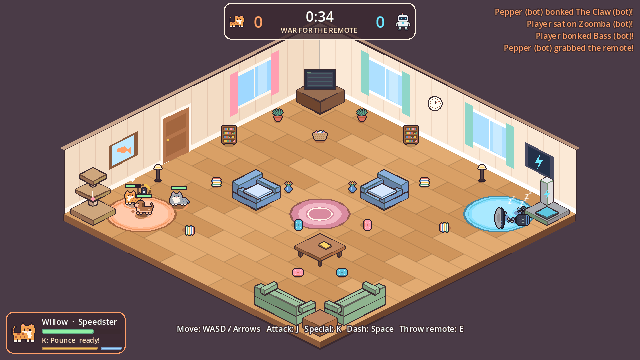
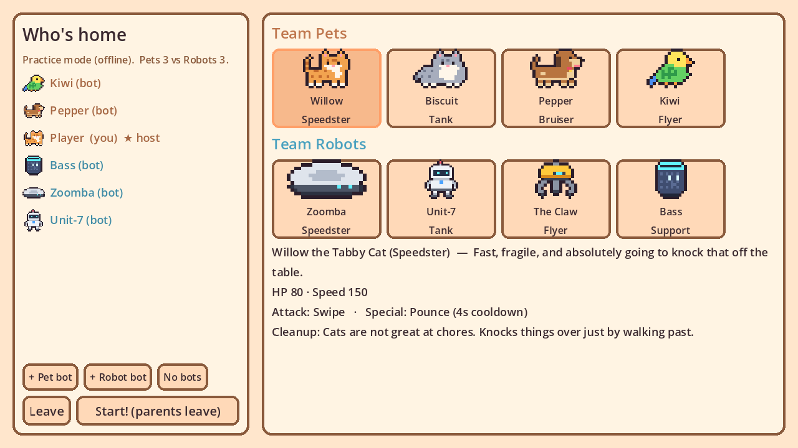
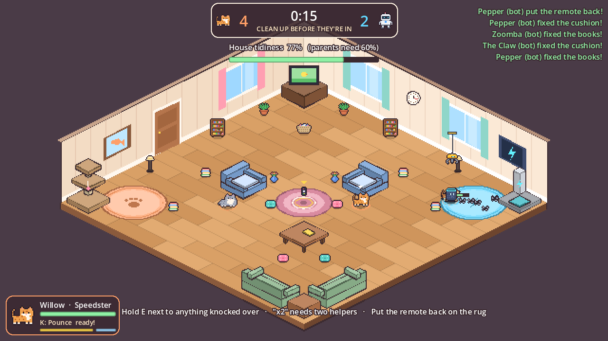
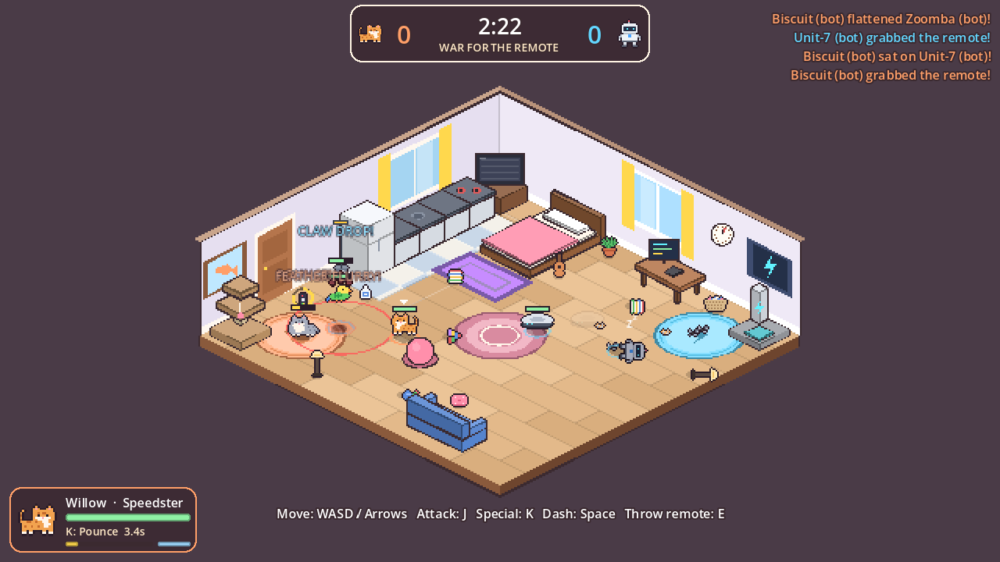
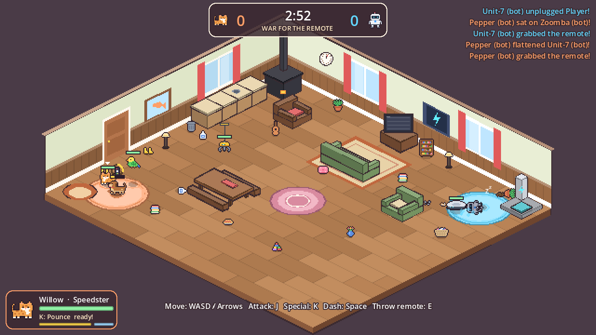
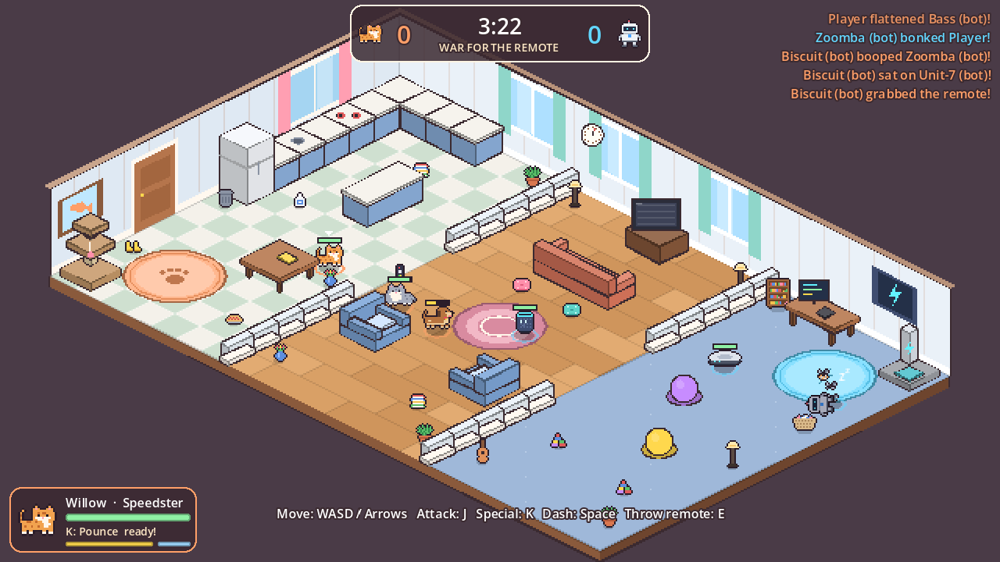
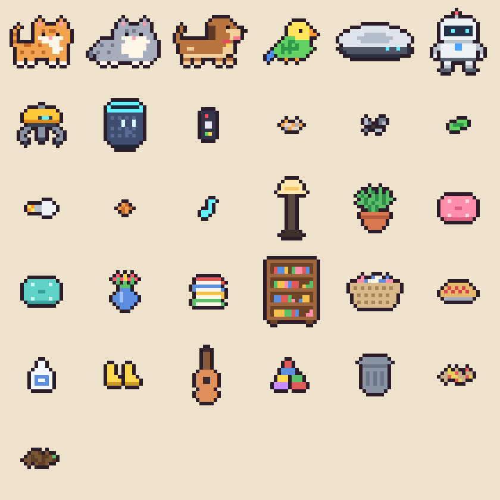

# Willow VS The World

A cozy, chaotic, isometric pixel-art multiplayer brawler. The parents just left
for the day. The **pets** and the **robots** immediately go to war over the TV
remote... and then have to put the whole house back together before the car
pulls back into the driveway.



**Phase 1: War for the remote.** Team capture-the-flag. Grab the remote, carry
it to your team's rug, and hold it there for two seconds to change the channel.
Bonk anyone who tries. KOs are just naps.

**Phase 2: Cover it up.** *CAR IN THE DRIVEWAY!* Truce. Everyone, both teams,
stands lamps back up, sweeps up fur and bolts, and returns the remote. The war's
winners only get to watch their show if the house passes inspection. Otherwise
everybody is grounded.

| Pick a side | Clean up together |
|---|---|
|  |  |

### The homes

Pick where the fight happens in the lobby. Each home plays differently.

| Studio Apartment | The Farmhouse | Suburban House |
|---|---|---|
|  |  |  |
| Tiny, cramped, constant brawling. 2-4 players. | Wood stove, farm table, a pie on the floor. 4-6 players. | Kitchen, living room and den behind knee-walls. 6-8 players. |

...plus **The Living Room**, the original. The design doc has a list of homes
to build next and a step-by-step guide to making your own.

The full design (rules, roster, homes, art direction, networking, roadmap) is in
**[docs/GAME_DESIGN.md](docs/GAME_DESIGN.md)**.

## The characters

| Team Pets | | Team Robots | |
|---|---|---|---|
| **Willow**, tabby cat | fast; *Pounce* | **Zoomba**, robot vacuum | fast; *Turbo Suck* pulls enemies and the remote |
| **Biscuit**, chonky cat | tank; *Belly Flop* | **Unit-7**, helper bot | tank; *Rocket Fist* |
| **Pepper**, pup | bruiser; *Big Bark* stuns | **The Claw**, ceiling gantry | flies; *Claw Drop* from above |
| **Kiwi**, budgie | flies; *Feather Flurry* | **Bass**, smart speaker | support; *Hype Track* heals |



## Play it

1. Download **[Godot 4.7](https://godotengine.org/download)** (free, the standard
   version, not .NET). It's a single ~150 MB program; nothing to install.
2. Open Godot, click **Import**, and select `game/project.godot` from this repo.
3. Press **F5** (or the ▶ button in the top right).

Choose **Practice vs bots** to play alone. Bots fill any empty spots, and you can
add or remove them in the lobby.

### Controls

| | Keyboard | Gamepad |
|---|---|---|
| Move | WASD / arrows | left stick |
| Attack | J | X |
| Special | K | Y |
| Dash | Space | A |
| Throw the remote / hold to tidy | E | B |
| Leave the match | Esc | |

### Playing with friends

- **Same Wi-Fi / LAN:** one person clicks **Host a game**. The lobby shows their
  local IP address. Everyone else types that IP into the box next to **Join**.
- **Over the internet:** the host must forward **UDP port 7777** on their router,
  and friends join with the host's public IP. The easier route is a free virtual
  LAN like [Tailscale](https://tailscale.com) or ZeroTier: everyone joins the same
  network and uses the host's Tailscale IP. Proper online matchmaking is on the roadmap.
- **Testing alone:** in the Godot editor, *Debug > Customize Run Instances...*,
  enable multiple instances, and run 2. Host in one window and join `127.0.0.1` in the other.

## Working on it

```
game/                     the Godot project (open game/project.godot)
  scenes/maps/            the homes: open one and drag furniture around
  scenes/level/           the building blocks every home is made of
  scenes/match/           rules (match.gd), characters (player.gd), bots, HUD
  scripts/core/roster.gd  every character's stats and moves (the balance sheet)
  assets/sprites/         pixel art (placeholders)
docs/GAME_DESIGN.md       the game design document
tools/make_sprites.py     regenerates the placeholder sprites from text grids
tools/smoke_test.sh       headless end-to-end tests
```

- **Tweak balance** in `game/scripts/core/roster.gd` and the `@export` values on
  the `Match` node (war/cleanup length, capture limit, respawn time).
- **Rearrange a home** by opening its scene in `game/scenes/maps/`. The room and
  furniture draw themselves right in the editor; change sizes, colours, windows and
  doors in the inspector. To add a new home, see *Making a new home* in the design doc.
- **Replace the art:** drop a PNG with the same name into `game/assets/sprites/`
  (for example `willow.png`). Characters face right, and the bottom of the image
  is where they touch the floor. [Aseprite](https://www.aseprite.org) is the go-to
  pixel-art tool. The placeholders come from `python3 tools/make_sprites.py`
  (needs `pip install pillow`); delete an entry there once you have real art for it.

### Tests

```
tools/smoke_test.sh path/to/godot
```

Runs headless (no window): imports the project, plays a full 3v3 bot match on
every home at top speed, then plays a real host + client network match over
localhost and checks that both machines agree on the map and the result. Takes
about a minute and a half. The same
checks run on GitHub for every push (`.github/workflows/smoke-test.yml`).

The game also takes launch options after `--`, which the tests use:
`--practice`, `--host`, `--join=IP`, `--map=studio`, `--bots=N`, `--char=willow`, `--autostart=N`,
`--autopilot`, `--war=SECONDS`, `--cleanup=SECONDS`, `--quit-after=SECONDS`,
`--screenshot=PATH@SECONDS`. For example, `godot --path game -- --practice --bots=5 --autostart=1`
drops you straight into a 3v3 match.
